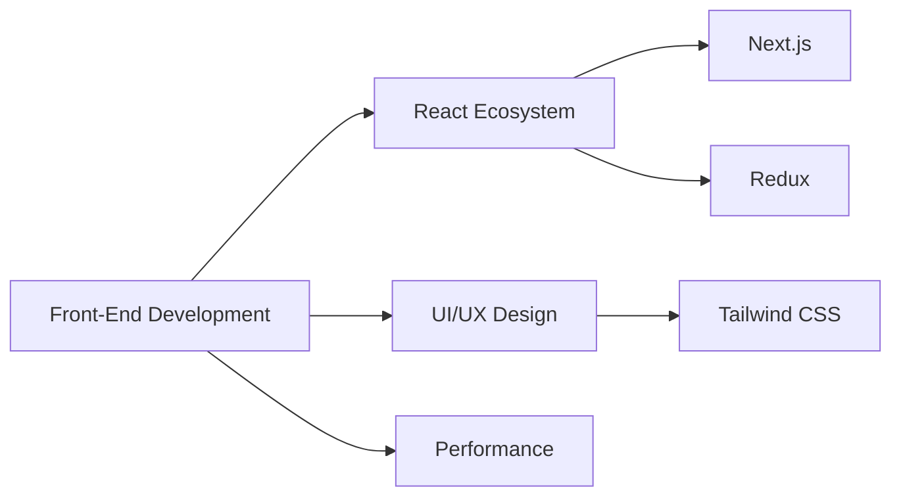
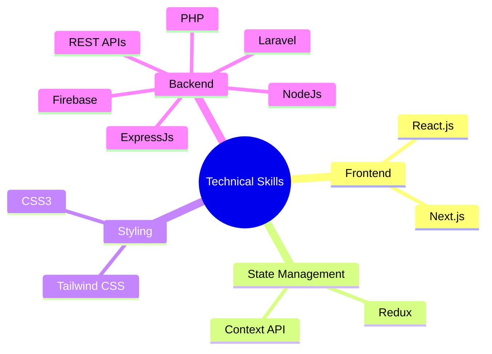
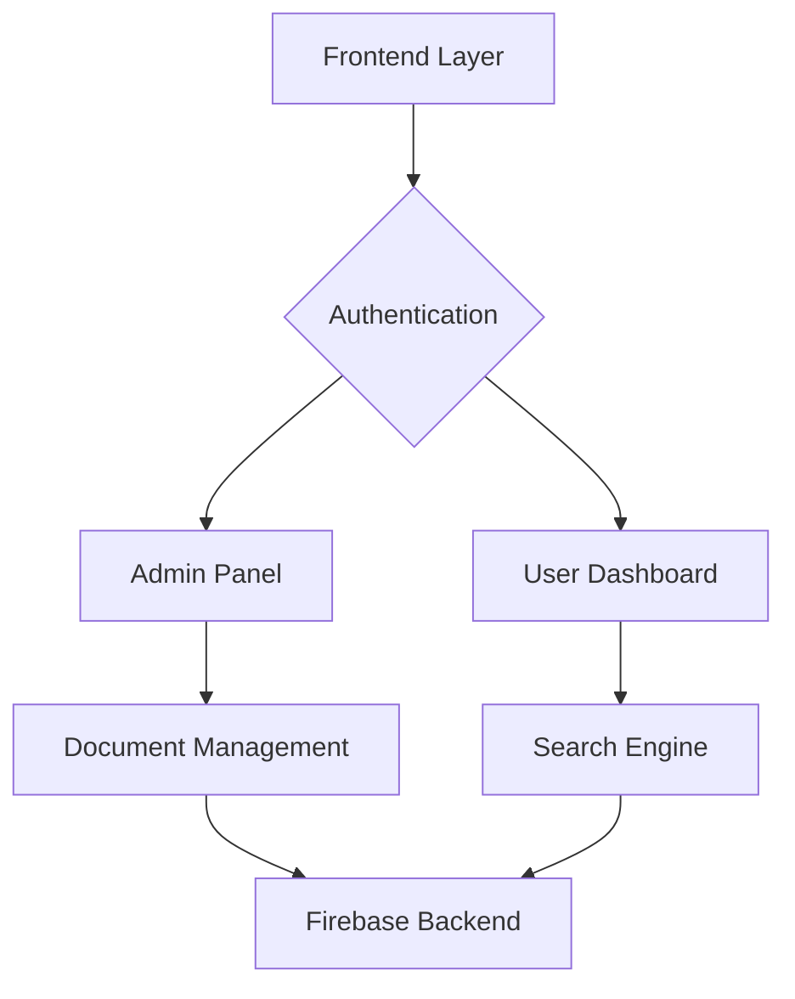
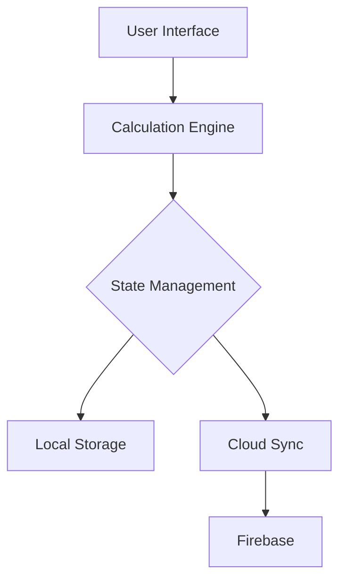
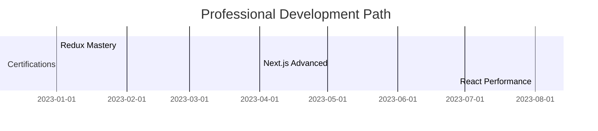
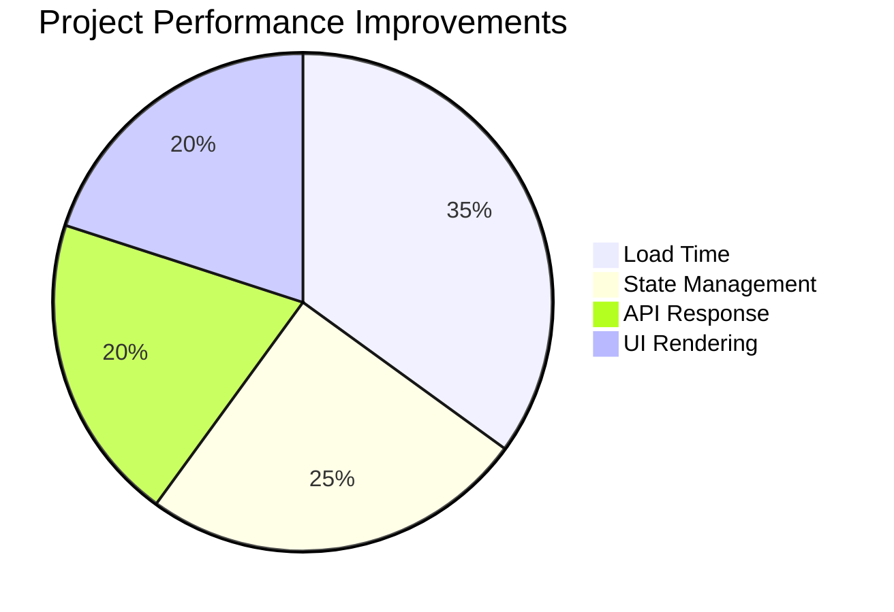
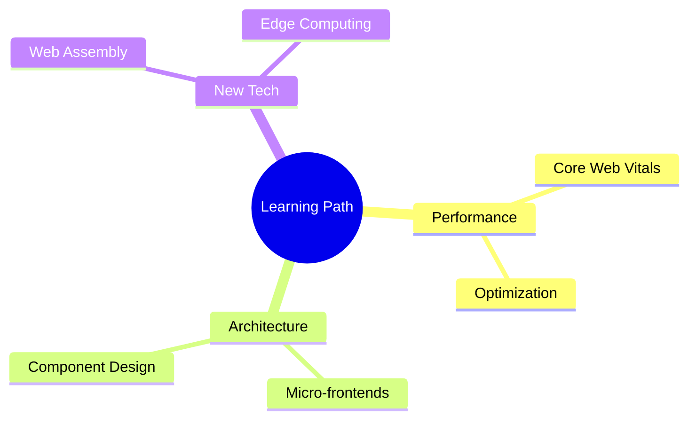

# SOAB MAHMUD SYFUDDHIN
## Front-End Engineer | Technical Solutions Architect

## 📊 TECHNICAL EXPERTISE OVERVIEW

### Core Technology Stack

## 🎯 PROFESSIONAL PROFILE
> "Building scalable, performant web applications with modern technologies"

**Contact Information**
- 📍 Kushtia, Dhaka, Bangladesh
- 📱 +8801644556543
- 📧 syfuddhin@gmail.com
- 🌐 https://syfuddhin.netlify.app

## 💼 FEATURED PROJECTS

### 1️⃣ Enterprise Notice Board System
**Role:** Lead Developer | **Timeline:** [jan-23 - oct-24 ]

#### System Architecture

#### Technical Implementation
| Component | Technology | Metrics |
|-----------|------------|---------|
| Frontend | Next.js 14 | 95% Performance |
| State | Redux Toolkit | 30% Faster Updates |
| UI | Tailwind CSS | 99% Responsive |
| Backend | Firebase | 99.9% Uptime |

#### Key Achievements
📈 Performance Metrics:
- Page Load: 1.2s
- First Paint: 0.8s
- TTI: 1.5s

🔍 Feature Implementation:
- Real-time search engine
- Role-based access control
- Document versioning system
- Advanced filtering system

### 2️⃣ Financial Calculator Platform
**Role:** Full-Stack Developer | **Timeline:** [jun-23- dec-23]

#### System Design

#### Technical Stack Analysis
| Layer | Technology | Impact |
|-------|------------|--------|
| UI | React.js | 92% User Satisfaction |
| Logic | TypeScript | 75% Bug Reduction |
| State | Redux | 40% Better Performance |
| Storage | Firebase | 99.9% Data Integrity |

## 🎓 PROFESSIONAL DEVELOPMENT

### Certification Timeline

### Course Completions
1. **Redux Ecosystem Mastery**
   - Advanced state management
   - Redux middleware
   - Performance optimization

2. **Next.js Professional**
   - Server components
   - API routes
   - Performance optimization

## 💡 INNOVATION METRICS

### Performance Optimization

### Technical Problem Solving
| Challenge | Solution | Impact |
|-----------|----------|--------|
| Data Loading | Implemented Lazy Loading | 40% Faster |
| State Updates | Redux Optimization | 35% Better Performance |
| API Calls | Request Batching | 50% Reduced Server Load |

## 🛠️ TECHNICAL TOOLKIT

### Development Environment
- **IDE:** VS Code with Custom Extensions
- **Version Control:** Git, GitHub
- **CI/CD:** GitHub Actions
- **Deployment:** Vercel, Netlify

### Testing & Quality
- React Testing Library
- Lighthouse Audits
- Performance Monitoring

## 🌱 CONTINUOUS LEARNING

### Current Focus Areas

## 🏆 ACHIEVEMENTS & RECOGNITION

### Technical Milestones
- 🥇 React Development Certification
- 🌟 Open Source Contributor
- 📊 Performance Optimization Specialist

### Impact Metrics
- Improved application performance by 45%
- Reduced build time by 30%
- Enhanced user engagement by 40%

## 🔗 PROFESSIONAL LINKS
- **Portfolio:** https://syfuddhin.netlify.app
- **GitHub:** [Username]
- **LinkedIn:** [Profile]
- **Technical Blog:** [Blog URL]

## 🌐 LANGUAGES
- **English:** Professional Working Proficiency
- **Bengali:** Native Proficiency

