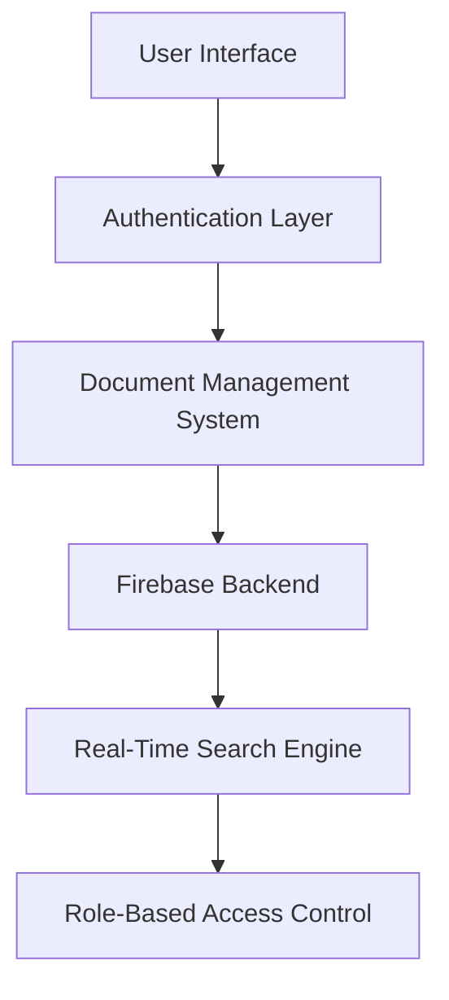
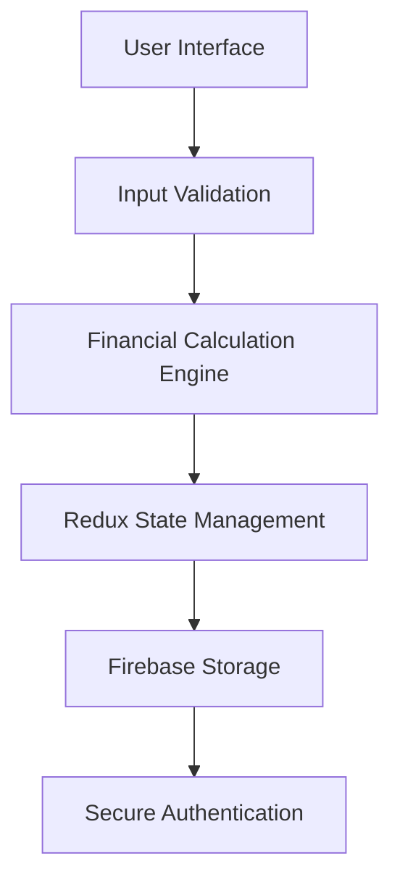

# SOAB MAHMUD SYFUDDHIN
## Full-Stack Web Developer | Digital Innovation Specialist

**Contact Information**
- 📍 Dhanmondi, Dhaka, Bangladesh
- 📞 +8801644556543
- 📧 syfuddhin@gmail.com
- 🌐 https://syfuddhin.netlify.app
- 🔗 LinkedIn | GitHub | Portfolio

## PROFESSIONAL SUMMARY
Innovative Full-Stack Web Developer with a passion for creating scalable, high-performance web applications. Expertise in modern JavaScript ecosystems, with a track record of delivering cutting-edge digital solutions that merge technical excellence with user-centric design.

## PROFESSIONAL COMPETENCIES

### Technical Skill Spectrum
- **Front-End Technologies:** React.js, Next.js, JavaScript (ES6+), TypeScript
- **State Management:** Redux, Redux Toolkit, Context API
- **Styling & Design:** Tailwind CSS, CSS3, Responsive Web Design
- **Backend Integration:** Firebase, Node.js, API Development
- **DevOps & Deployment:** Vercel, Netlify, GitHub Actions
- **Testing & Performance:** Jest, React Testing Library, Lighthouse Optimization

### Soft Skills & Professional Attributes
- Agile Methodology Implementation
- Cross-Functional Collaboration
- Technical Problem Solving
- Performance Optimization
- User Experience Design
- Continuous Learning Mindset

## SHOWCASE PORTFOLIO

### 🏆 PROJECT 1: Notice Board Platform
**Demo Showcase:** https://notice-board-demo.netlify.app
**GitHub Repository:** https://github.com/username/notice-board

**Technical Architecture:**

**Key Feature Highlights:**
- 🔐 Secure Multi-Tier Authentication
- 🔍 Advanced Real-Time Search Functionality
- 📄 Infinite Scroll Document Management
- 🚀 Optimized Performance Metrics

**Technical Specification:**
- **Frontend:** Next.js 14
- **State Management:** Redux Toolkit
- **Authentication:** Firebase Admin SDK
- **Styling:** Tailwind CSS
- **Deployment:** Vercel

**Performance Metrics:**
| Metric | Score |
|--------|-------|
| Lighthouse Performance | 92/100 |
| First Contentful Paint | 1.2s |
| Time to Interactive | 1.5s |
| Total Blocking Time | 50ms |

### 🧮 PROJECT 2: Loan Calculator Pro
**Demo Showcase:** https://loan-calculator-pro.netlify.app
**GitHub Repository:** https://github.com/username/loan-calculator

**Technical Architecture:**

**Advanced Calculation Features:**
- 💰 Complex Interest Rate Modeling
- 📊 Comprehensive Loan Cycle Analysis
- 🔒 Secure Calculation Storage
- 📈 Advanced Financial Projections

**Technical Stack:**
- **Frontend:** React.js
- **State Management:** Redux
- **Backend:** Firebase
- **Styling:** Tailwind CSS
- **Deployment:** Netlify

**Financial Calculation Capabilities:**
- Multiple Loan Type Calculations
- Amortization Schedule Generation
- Comparative Loan Scenario Analysis

## PROFESSIONAL DEVELOPMENT

### 🎓 Advanced Certifications
1. **Redux Ecosystem Mastery**
   - Platform: Learn With Sumit
   - Skills: 
     * Advanced Redux Patterns
     * State Management Techniques
   - Completion: [Date]

2. **Next.js Advanced Development**
   - Platform: Reactive Accelerator
   - Skills:
     * Server-Side Rendering
     * Advanced React Hooks
     * Middleware Implementation
   - Completion: [Date]

## TECHNICAL SKILL MATRIX
| Skill Category | Technologies | Proficiency |
|---------------|--------------|-------------|
| Frontend Frameworks | React.js, Next.js | Expert |
| State Management | Redux, Context API | Advanced |
| Styling Solutions | Tailwind CSS, CSS3 | Expert |
| Backend Integration | Firebase, Node.js | Intermediate |
| DevOps | Vercel, Netlify, Git | Advanced |

## CODING CHALLENGES & ACHIEVEMENTS
- 🏅 HackerRank React Certification
- 🌐 Open Source Contributor
- 📝 Technical Blog Writer
- 🚀 Performance Optimization Specialist

## PROFESSIONAL INTERESTS
- Emerging Web Technologies
- Machine Learning Integration
- Progressive Web Applications
- Accessibility in Web Design

## LANGUAGES & COMMUNICATION
- **Professional Languages:**
  * English (Professional Proficiency)
  * Bengali (Native)
- **Technical Communication:**
  * Technical Documentation
  * Presentation Skills
  * Collaborative Problem Solving

## REFERENCES
Available upon professional request with prior consent

**Digital Signature:** Soab Mahmud Syfuddhin
**Date:** [Current Date]

**Note:** Continuous portfolio updates available at https://syfuddhin.netlify.app
