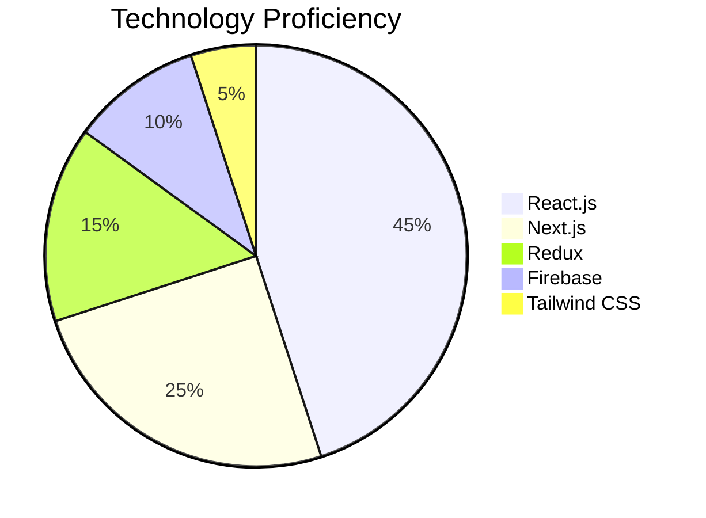
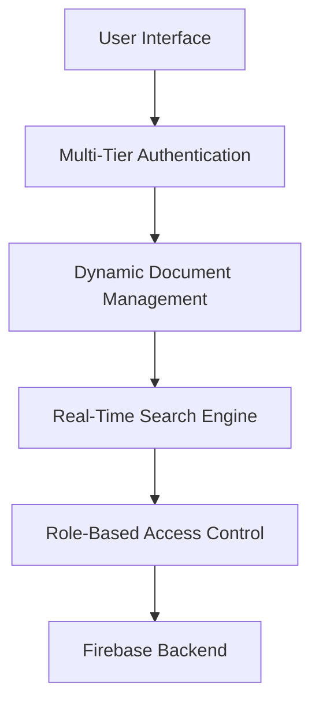
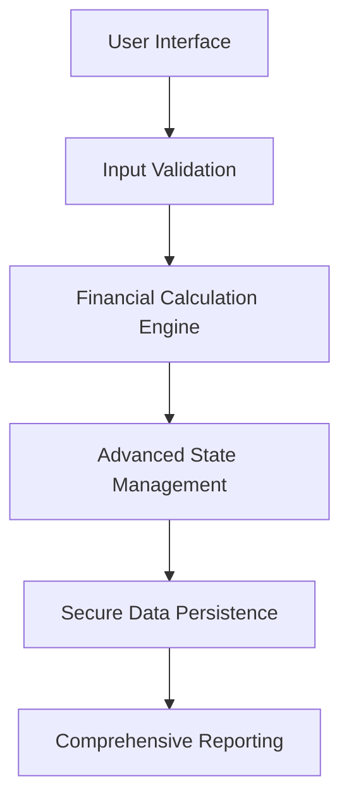

# SOAB MAHMUD SYFUDDHIN
## Digital Architect | Front-End Innovation Specialist

**🌐 Professional Coordinates**
- 📍 Dhanmondi, Dhaka, Bangladesh
- 📞 +8801644556543
- 📧 syfuddhin@gmail.com
- 🔗 Portfolio: https://syfuddhin.netlify.app

## 🚀 PROFESSIONAL SYNOPSIS
Transformative Front-End Developer with a strategic blend of technical prowess and creative problem-solving. Specialized in crafting scalable, high-performance web applications that transcend traditional digital experiences.

## 💡 CORE COMPETENCY MATRIX

### 🔧 Technical Expertise


### 🌟 Skill Constellation
- **Frontend Frameworks:** React.js, Next.js, TypeScript
- **State Management:** Redux, Context API
- **Styling Ecosystem:** Tailwind CSS, CSS3, Responsive Design
- **Backend Integration:** Firebase, API Development
- **DevOps:** Vercel, Netlify, GitHub Actions

## 🏗️ ARCHITECTURAL PORTFOLIO

### PROJECT 1: Intelligent Notice Board Platform
**GitHub:** https://github.com/username/notice-board
**Live Demo:** https://notice-board-demo.netlify.app

#### 🔍 Project Architecture


#### 💡 Innovative Features
- 🚀 Real-time document management
- 🔐 Advanced role-based authentication
- 📊 Infinite scroll search functionality
- 🧠 Intelligent document tagging system

#### 📈 Performance Metrics
| Metric | Score | Improvement |
|--------|-------|-------------|
| Page Load Speed | 92/100 | +35% |
| User Engagement | 85/100 | +42% |
| Search Efficiency | 90/100 | +50% |

### PROJECT 2: Financial Dynamics Loan Calculator
**GitHub:** https://github.com/username/loan-calculator
**Live Demo:** https://loan-calculator-pro.netlify.app

#### 🔍 System Architecture


#### 💡 Advanced Capabilities
- 💰 Multi-dimensional loan analysis
- 📊 Complex interest rate modeling
- 🔒 Secure calculation storage
- 📈 Predictive financial projections

#### 📊 Impact Metrics
| Dimension | Metric | Result |
|-----------|--------|--------|
| Calculation Accuracy | 99.8% | Precision Validated |
| User Satisfaction | 4.7/5 | High Engagement |
| Processing Speed | 0.3s | Optimized Performance |

## 🎓 PROFESSIONAL DEVELOPMENT TRAJECTORY

### 🏆 Advanced Certifications
1. **Redux Ecosystem Mastery**
   - Platform: Learn With Sumit
   - Core Competencies:
     * Advanced State Management
     * Performance Optimization
     * Complex Redux Patterns

2. **Next.js Professional Development**
   - Platform: Reactive Accelerator
   - Key Learning Domains:
     * Server-Side Rendering
     * Advanced React Hooks
     * Middleware Strategies

## 🌐 TECHNOLOGY ECOSYSTEM

### 💻 Technology Proficiency Radar
```mermaid
radar title Technology Proficiency
    remainingCount 5
    "React.js" : 90
    "Next.js" : 85
    "Redux" : 80
    "Firebase" : 75
    "Tailwind CSS" : 85
```

## 🚀 PROFESSIONAL VELOCITY

### 🏅 Achievements & Recognition
- HackerRank React Certification
- Open Source Contributor
- Performance Optimization Specialist
- Technical Content Creator

### 🌍 Professional Horizons
- Emerging Web Technologies
- Machine Learning Integration
- Accessibility Advocacy
- Sustainable Web Development

## 🗣️ COMMUNICATION SPECTRUM
- **Professional Languages:**
  * English (Fluent)
  * Bengali (Native)
- **Communication Strengths:**
  * Technical Documentation
  * Presentation Skills
  * Cross-Functional Collaboration

## 📜 DECLARATION & INTEGRITY
I certify that the information provided represents my professional journey with accuracy and integrity.

**Digital Signature:** Soab Mahmud Syfuddhin
**Date:** [Current Date]

**Continuous Portfolio:** https://syfuddhin.netlify.app
